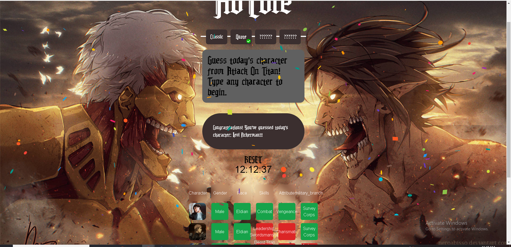
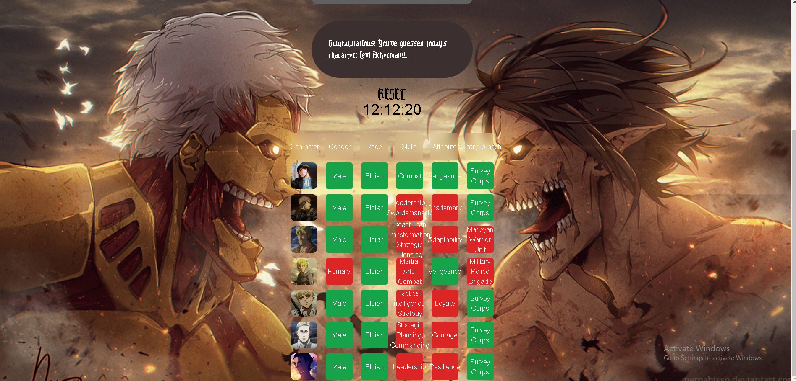
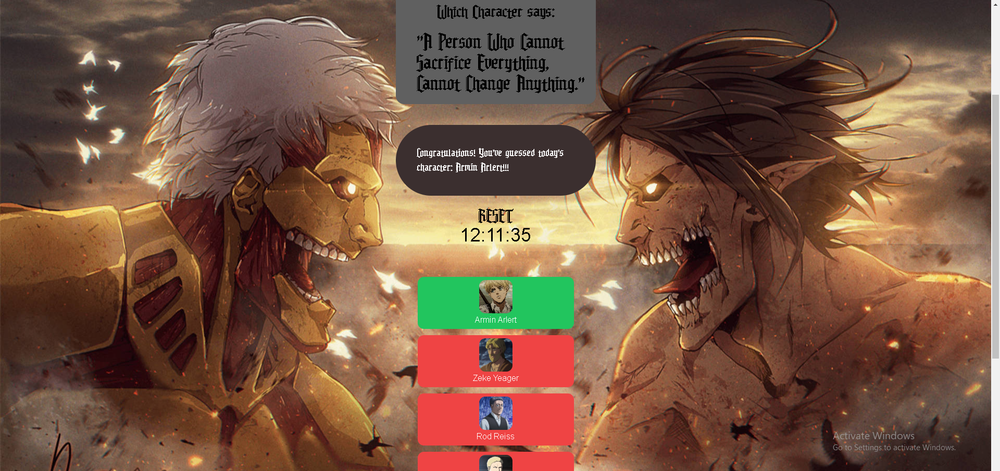

# AoTdle - Character of the Day Game

Welcome to **AOTDLE**! AOTDLE is a fun, interactive game built with React where players try to guess the "Character of the Day". Players make guesses and are given clues based on the character's attributes. Keep guessing until you find the right character by using hints such as their quotes, attributes, and more!

## Table of Contents

- [Gameplay](#gameplay)
- [Screenshots](#screenshots)
- [Contact](#contact)

## Gameplay

1. **Objective:**
   The goal of AOTDLE is to correctly guess the "Character of the Day."

2. **How to Play:**

   - Start the game and try guessing a character by typing their name.
   - If your guess is incorrect, various attributes of your character will be compared with the "Character of the Day."
   - The attributes will be color-coded:
     - **Green Background**: Indicates that this attribute matches with the "Character of the Day."
     - **Red Background**: Indicates that this attribute does not match the "Character of the Day."
   - Based on the clues, continue guessing until you find the correct character.

3. **Winning:**
   - Once you correctly guess the character, you win the game for the day!
   - Come back tomorrow for a new challenge with a different "Character of the Day."

## Screenshots

## Contact

For any questions or feedback, please contact:

- **Your Name**: [foxfireninetails9@gmail.com](mailto:foxfireninetails9@gmail.com)
- **GitHub**: [qbeeeeee](https://github.com/qbeeeeee)
